# 编译和使用说明

本项目编译和使用都使用`make`管理


## 环境

### 开发环境

```ASN.1
OS: Arch Linux x86_64 
Host: HP Pavilion Aero Lapt-getop 13-be1xxx 
Kernel: 6.11.9-arch1-1 
DE: Plasma 6.2.3 
WM: KWin 
Theme: Breeze-Dark [GTK2], Breeze [GTK3] 
Icons: Colloid [GTK2/3] 
Terminal: konsole
```

### 移植测试环境
测试环境1
```ASN.1
OS: Kali GNU/Linux Rolling x86_64 
Host: 911Air Type1Version 
Kernel: 6.11.2-amd64 
DE: GNOME 45.3 
WM: Mutter 
Theme: adw-gtk3-dark [GTK2/3] 
Icons: Flat-Remix-Blue-Dark [GTK2/3] 
Terminal: gnome-terminal 
```
测试环境2
```ASN.1
OS: Ubuntu 22.04.3 LTS on Windows 10 x86_64 
Kernel: 5.15.167.4-microsoft-standard-WSL2
Theme: Yaru [GTK3] 
Icons: Yaru [GTK3] 
Terminal: vscode
```
### 依赖项安装(以`Ubuntu22.04`为例)
项目的图形化部分使用`QT5`开发，故需要`QT5`的有关依赖

```shell
sudo apt-get update
sudo apt-get install qtbase5-dev qtchooser qt5-qmake qttools5-dev-tools
```
`C++`编译工具链安装：

```shell
sudo apt-get update
sudo apt-get install build-essential cmake
```

显示有关依赖安装：
```shell
sudo apt-get update
sudo apt-get install libglu1-mesa-dev freeglut3-dev mesa-common-dev
```


## 编译

打开项目根目录，在终端中运行：

```shell
make all
```

> 请注意：项目根目录所在路径中不能含有空格、括号、中文字符

## 运行

在项目根目录运行：

```shell
make run
```

> 请再次注意：项目根目录所在路径中不能含有空格、括号、中文字符

## 使用说明

### 主界面

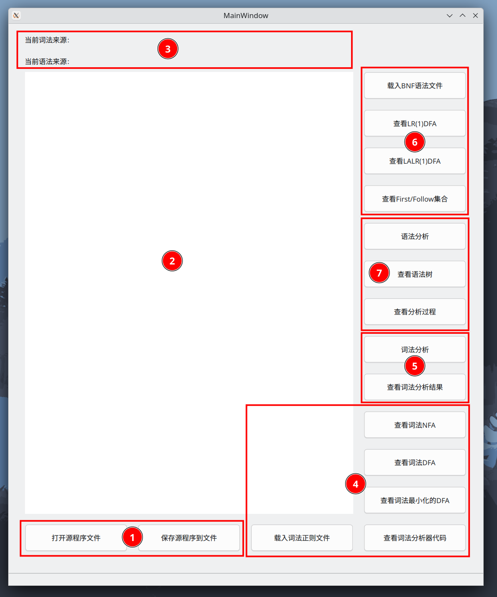

界面主要分为7个区域，分别为：

- 文件管理
- 源程序
- 缓存
- 词法分析器展示
- 词法分析器使用
- 语法分析器展示
- 语法分析器使用

下面将展示每个区域的作用

#### $\mathit{1}$ 文件管理

提供了两个按钮：打开源程序文件/保存源程序到文件

##### 打开源程序文件
  - 点击按钮，将会打开一个文件资源管理器，使用者可以选择对应的源程序文件，文件中的内容会被载入到源程序区供使用者查看和修改
##### 保存源程序到文件
  - 点击按钮，将会打开一个文件资源管理器，使用者可以选择文件，将源程序区的内容覆写到被选中的文件里

#### $\mathit{2}$ 源程序

提供了一个文本框，可以输入程序或者修改载入后的程序

#### $\mathit{3}$ 缓存

缓存区保存了最近一次词法正则和语法BNF文件的输入信息

- 词法来源如果不为空，那么随时可以查看词法分析器有关信息以及进行词法分析

  > 即可以点击词法分析器展示和词法分析器使用区域的按钮

- 语法来源如果不为空，可以随时查看LR(1)DFA等语法分析器相关信息

  > 即可以点击语法分析器展示区域的按钮

- 词法来源和语法来源同时不为空时，可以进行语法分析并查看语法分析的有关信息

  > 即此时可以点击语法分析器使用区域的按钮

#### $\mathit{4}$ 词法分析器展示

词法分析器由词法分析器生成器生成。

生成词法分析器，词法分析器生成器读入`.rul`格式的正则文件，输出`code.cpp`文件，与预定义好的`getInput.h`文件一起编译即可得到词法分析器

##### 载入词法正则文件

  - 点击按钮，将会打开一个文件资源管理器，你需要选中已经编写好的词法正则文件

    > 提示：
    > 1. 在`project/input`目录下，提供了`miniC`和`tiny`语言的正则文件
    > 2. 生成词法分析器对机器性能要求较高，部分性能较低的机器可能需要较长时间进行生成
    
    随后，生成器会自动开始生成词法分析器
    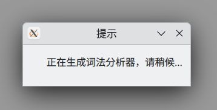

    生成完成后，会弹出窗口提示生成完成。
    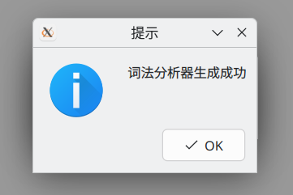

##### 查看词法NFA
  - 如果词法分析器生成完成，点击此按钮可以分别展示当前词法分析器所能识别的正则表达式的NFA
    
    > 下面是一个`tiny`的示例
    > 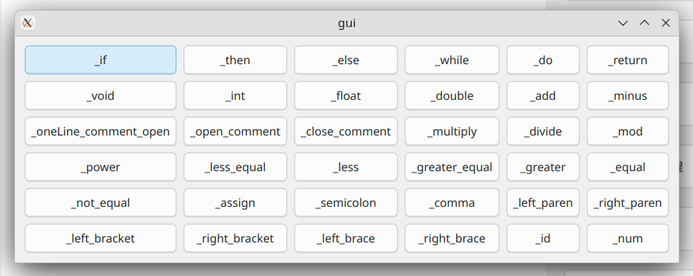
    >
    > 选择需要查看的NFA（以`_if`为例）
    >
    > 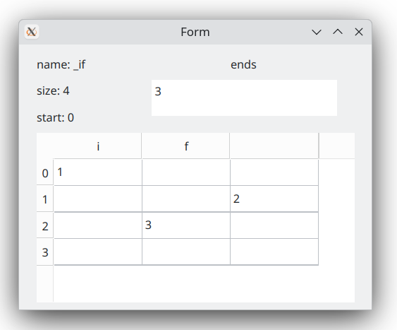
    >
    > 即可查看对应的信息

##### 查看词法DFA

  - 基本操作逻辑同上

##### 查看词法最小化的DFA

  - 基本操作逻辑同上

##### 查看词法分析器源代码

  - 点击按钮，即可查看词法分析器的源代码`code.cpp和getInput.h`

    如图：
    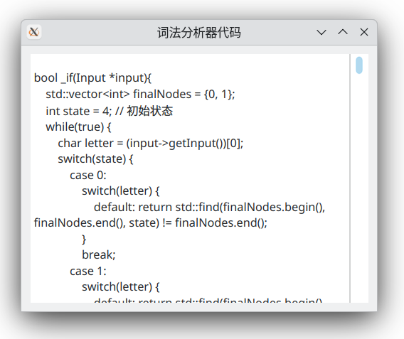

#### $\mathit{5}$ 词法分析器使用

进行词法分析需要保证源代码文本框不为空

##### 词法分析
  - 点击按钮，当词法分析结束时会有弹窗提示词法分析完成
##### 查看词法分析结果
  - 如果已经进行词法分析，点击按钮，即可查看词法分析结果
    如图：
    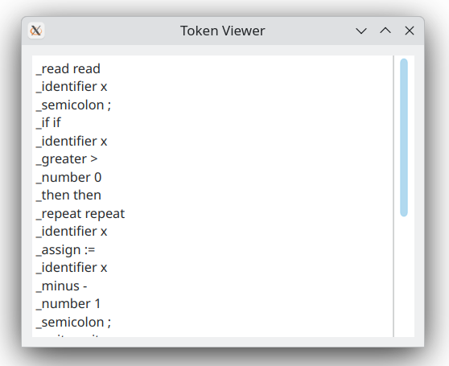

#### $\mathit{6}$ 语法分析器展示

语法分析器在载入BNF文法文件(`.grm`)之后会先进行预处理，随后就可以查看语法分析器的有关信息

##### 载入BNF文法文件

  - 点击此按钮将会打开一个文件资源管理器，使用者选择对应的BNF文法文件(`.grm`)即可
    随后语法分析器会自动进行预处理

    > 一般来说，语法分析器预处理所需时间不会太长，但在某些性能薄弱的机器上，可能需要10秒甚至更长的时间，在此期间界面可能处于无响应状态，请耐心等待即可

##### 查看LR(1)DFA

  - 点击按钮，即可查看以表格形式呈现的LR(1)DFA
    如图：
    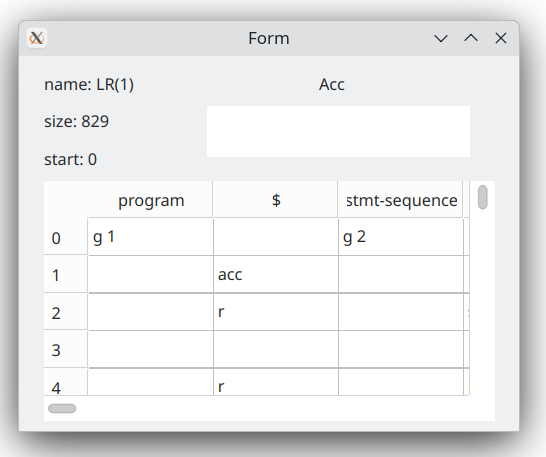

##### 查看LALR(1)DFA

  - 同上

##### 查看First/Follow集合

  - 点击按钮，即可查看First/Follow集合
    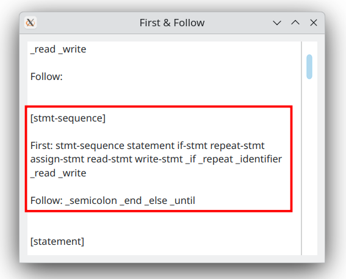

    >红色框内为一个符号First/Follow集合展示示例
    >
    >`[ ]`内即为展示的非终结符
    >
    >`First:` 后所跟随的是First集合中的元素，以空格间隔
    >`Follow:`后所跟随的是Follow集合中的元素，以空格间隔

#### $\mathit{7}$ 语法分析器使用

在预处理完BNF文法文件和词法分析器完成生成之后，即可进行语法分析

##### 语法分析

  - 点击按钮，即可进行文本框内的源程序进行，语法分析，当语法分析结束时会弹出提示

##### 查看语法树

  - 点击按钮，即可在新窗口查看语法树
    如图：

    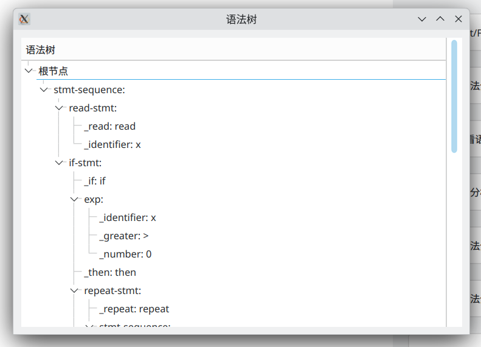

##### 查看分析过程

  - 点击按钮，即可在新窗口查看语法分析过程
    如图：
    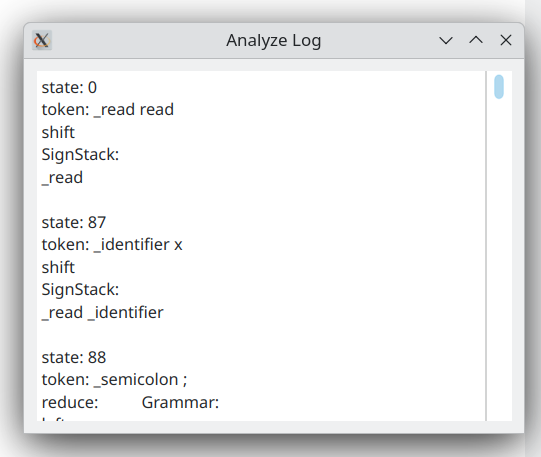

## 输入输出
在上面的演示中提到了词法正则文件、BNF语法文件、源程序文件

下面将介绍词法正则文件、BNF文法文件的标准格式

对于Python这类对缩进有强要求的语言，你需要了解额外的`ignore.txt`

对于语法树的生成你需要了解额外的TreeIgnore.txt


### 词法正则文件
你需要在这里提供所分析语言的**所有可能符号及其组合**的正则表达式，推荐后缀为`.rul`

- 示例：

  ```ASN.1
  _if = if
  num = [0-9]
  _float = num+(.num+)?
  ```

- 对于示例的解释

  对于所分析语言，我们需要提供所有需要识别符号的正则表达式，并给予合适的命名

  命名规则：

  - 如果是需要识别的正则表达式，需要在前面加上下划线`_`
  - 如果该表达式不需要被识别，只是作为中间表达式，则前面不能有下划线
  - 对于一些已经在正则表达式中的运算符号，如`+` `(` `)`等，需要在前面加上反斜杠`\`来标识其不是正则运算符号

### BNF文法文件

你需要在这里提供所分析语言的BNF文法

- 实例：
- 对于示例的解释：
- 注意事项：

### token忽略文件(`ignore.txt`)

你需要在这里提供需要忽略的token

例如，对一般的程序设计语言，`tab` `space` `enter` 一般仅简单作为分隔符使用，不构成语句的组成成分，故它们应该在语法分析中被忽略。

另外，注释也应该在语法分析中被忽略。

故在默认的`ignore.txt`中，默认添加了以下内容

```ASN.1
_space
_tab
_enter
_comment
_open_comment
_close_comment
_oneLine_comment_open
```

请根据需求增加或缩减该内容


### 语法树忽略文件(`TreeIgnore.txt`)

你需要在这里提供需要处理的树节点

由于有些节点对语法树构成无太大作用，仅作为分隔符，故在语法树生成时，应该做相应的处理

除此之外，有些仅作为空占位符的语法成分，也可以添加到其中，使

对`miniC`和`tiny`来说，有以下节点可以忽略：

> 它们并不会冲突，如果只是测试这两种语言可以不作修改

```ASN.1
_left_paren
_right_paren
_semicolon
_right_brace
_left_brace
statement-list
local-definitions
_end
```

请根据需求增加或缩减该内容


## 其他功能

如果需要清除预构建的内容，只需要执行：

```shell
make clean
```

之后重新编译运行即可
